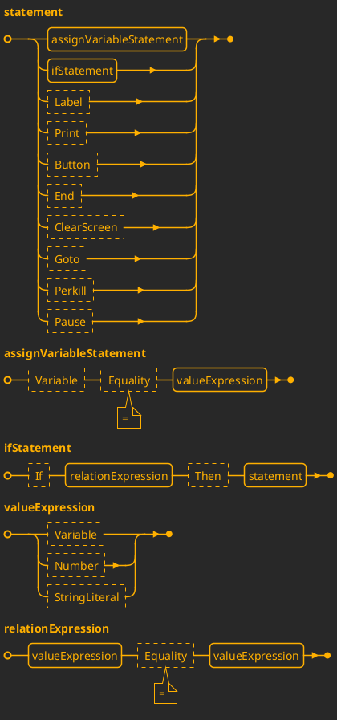

# Синтаксическая диаграмма

```plantuml
@startebnf URQL Line
!theme crt-amber

statement = 
      assignVariableStatement
    | ifStatement
    | ? Label ?
    | ? Print ?
    | ? Button ?
    | ? End ?
    | ? ClearScreen ?
    | ? Goto ?
    | ? Perkill ?
    | ? Pause ?;

assignVariableStatement = ? Variable ?,  ? Equality ? (*""=""*), valueExpression;

ifStatement = ? If ?, relationExpression, ? Then ?, statement;

valueExpression = ? Variable ? | ? Number ? | ? StringLiteral ?;

relationExpression = valueExpression, ? Equality ? (*""=""*), valueExpression;
@endebnf
```