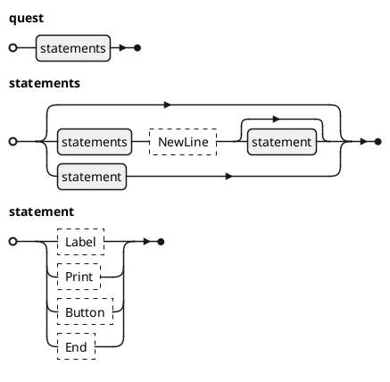
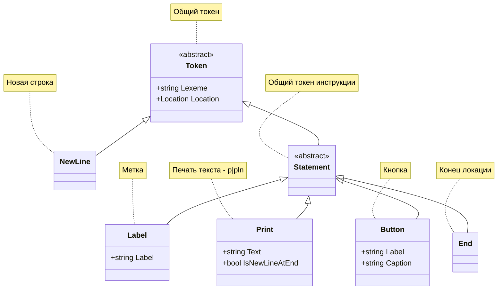

# Синтаксическая диаграмма


## Адаптация левых рекурсий
### `statements`


# Токены


# Лексемы
Примечения:  
1. Не отображаемые символы табуляции `\t` и новой строки `\t` показаны экранированными спецсимволами.
2. Лексемы для инструкций (метка, `p`|`pln`, `btn`, `end`) пока простые - концом лексемы считается новая строка `\n`, однострочный комментарий `;` или конец файла - т.е. пока не учитываются многострочные комментарии `/*`, переносы строк `_` и объединение инструкций `&`.

| Токен | Значение  | Лексема   | Пример    | Комментарий   |
| ---   | ---       | ---       | ---       | ---           |
| &mdash; | Пробельные символы | пробел ` ` или табуляция `\t` | ` \t \t ` | Не создают токена. Символ возврата каретки `\r` полностью игнорируется за ненадобностью. |
| `NewLine` | Новая строка | новая строка `\n` | `\n` | Вынесена в отдельную лексему из пробельных символов, т.к. участвует в синтаксисе как обязательный разделитель инструкций. |
| &mdash; | Однострочный комментарий | `;` и любые символы до конца строки | `; Это комментарий` | Пока поддерживаются только однострочные комментарии. Комментарии не создают токена, т.к. не используются в URQ.
| `Label` | Метка | `:` и любые символы до конца лексемы | `:Локация1` | |
| `Print` | Печать текста | `p` или `pln`, пробел ` ` или табуляция `\t` и любые символы до конца строки или однострочного комментария `;` | `pln Привет, мир!` | |
| `Button` | Кнопка | `btn`, пробел ` ` или табуляция `\t`, имя метки, запятая `,` и текст надписи до конца строки или однострочного комментария `;` | `btn 1,В лес` | |
| `End` | Конец локации | `end` | `end` | |

## РБНФ-диаграммы лексем
```plantuml
@startebnf Лексемы
(* Регистр не учитывается *)

Пробельный_символ = ' ' | '\t';

NewLine = '\n';

Однострочный_комментарий = ';', { ? не \n ? (*текст комментария*) };

Label = ':', { ? не '\n', ';' ? (*название метки*) };

Print = ("p" | "pln"), [(' ' | '\t'), { ? не '\n', ';' ? (*выводимый текст*) }];

Button = "btn", (' ' | '\t'), {? не ',', '\n' ? (*метка*)}, ',', {? не '\n', ';' ? (*текст кнопки*)};

End = "end";
@endebnf
```