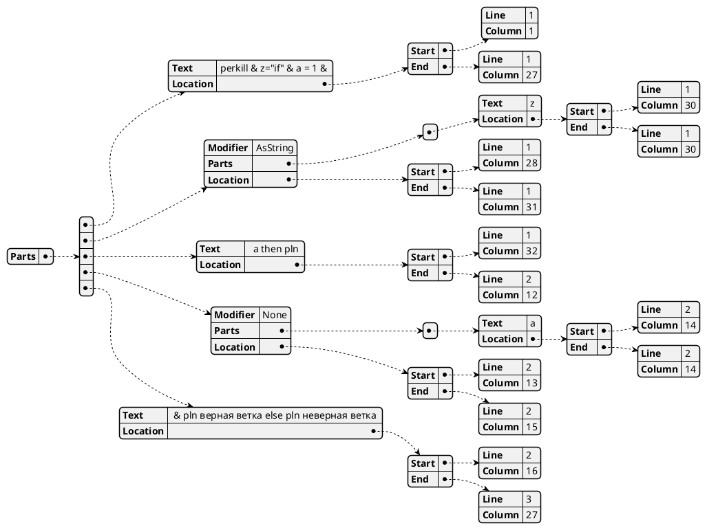
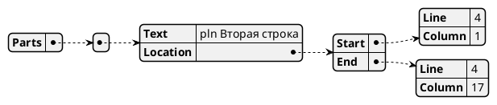
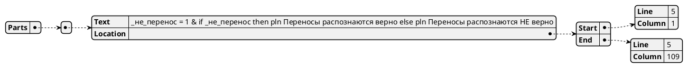

# Распознавание URQL
## Этапы распознавания
URQL загружается как входной поток символов и последовательно проходит через следующие этапы, где фильтруется, обогащается и распознаётся в структуры:

| № | Этап  | Тип   | Описание
| -:| ----- |:-----:| --------
| 1 | Удаление ненужных символов    | Фильтрация    | Удаляются ненужные символы (пока это только символ возврата каретки `<CR>`).
| 2 | Добавление координат  | Обогащение    | К каждому символу добавляется координата $[строка, колонка]$.
| 3 | Удаление комментариев | Фильтрация    | Удаляются однострочные и многострочные комментарии.
| 4 | Схлопывание переносов | Фильтрация    | Переносы `_` схлопываются (строки склеиваются).
| 5 | Разбивка на строки    | Распознавание | Весь поток символов бьётся на строки по символу новой строки `<LF>`.
| 6 | Распознавание подстановок | Распознавание | Строка распознаётся как набор подстановок.
| 7 | Распознавание строк с метками | Распознавание | Строка без подстановок может распознаться как строка с меткой (`:метка`) 

### Выходной результат
После прохождения всех 6 этапов на выходе получается список, состоящий из двух типов элементов: распознанных URQ-команд и распознанных (но не вычисленных) подстановок.

### Пример обработки кода
Возьмём для примера следующий URQL-код:
```urql
perkill & z="if" & a = 1 & #%z$ /* сюда должен попасть if */ a
	_ then pln #a$ & pln верная ветка
	_ else pln неверная ветка ; а это коммент в конце
pln Вторая строка
_не_перенос = 1 & if _не_перенос then pln Переносы распознаются верно else pln Переносы распознаются НЕ верно
```
#### Этап 1. Удаление ненужных символов
В примере нет явного символа возврата каретки `<CR>`, поэтому пример выглядит точно так же:
```urql
perkill & z="if" & a = 1 & #%z$ /* сюда должен попасть if */ a
        _ then pln #a$ & pln верная ветка
        _ else pln неверная ветка ; а это коммент в конце
pln Вторая строка
_не_перенос = 1 & if _не_перенос then pln Переносы распознаются верно else pln Переносы распознаются НЕ верно
```

#### Этап 2. Добавление координат
Т.к. для каждого символа добавляется структура с координатами, мы опустим её в примерах и оставим только строку:
```urql
perkill & z="if" & a = 1 & #%z$ /* сюда должен попасть if */ a
        _ then pln #a$ & pln верная ветка
        _ else pln неверная ветка ; а это коммент в конце
pln Вторая строка
_не_перенос = 1 & if _не_перенос then pln Переносы распознаются верно else pln Переносы распознаются НЕ верно
```

#### Этап 3. Удаление комментариев
```urql
perkill & z="if" & a = 1 & #%z$  a
        _ then pln #a$ & pln верная ветка
        _ else pln неверная ветка
pln Вторая строка
_не_перенос = 1 & if _не_перенос then pln Переносы распознаются верно else pln Переносы распознаются НЕ верно
```

#### Этап 4. Схлопывание переносов
```urql
perkill & z="if" & a = 1 & #%z$  a then pln #a$ & pln верная ветка else pln неверная ветка
pln Вторая строка
_не_перенос = 1 & if _не_перенос then pln Переносы распознаются верно else pln Переносы распознаются НЕ верно
```

#### Этап 5. Разбивка на строки
| # | Строка |
|-:|-|
| 1 | `perkill & z="if" & a = 1 & #%z$  a then pln #a$ & pln верная ветка else pln неверная ветка` |
| 2 | `pln Вторая строка` |
| 3 | `_не_перенос = 1 & if _не_перенос then pln Переносы распознаются верно else pln Переносы распознаются НЕ верно` |

#### Этап 6. Распознавание подстановок
Вся строка распознаётся как строка с подстановками. На выходе получается древовидная структура (конкретная структура и названия полей примерные):
#### Строка 1

#### Строка 2

#### Строка 3


### Открытые вопросы
#### Этап "Удаление ненужных символов"
- Возможно, есть полезные символы, которые при этом не являются печатными (при выводе на экран не образуют символа, даже пробельного) - например, символ сигнала (`BELL`) может быть полезным для воспроизведения звука, но при этом не печатный.

## Связаное распознавание URQL и выполнение команд
При выпонении строки с подстановками пошагово выполняются три этапа в тесной связке:
- Парсер URQL пытается распознать URQ-команду по токенам и выполнить её. В случае, если команда содержит продолжение (`if`, `else`, `&` и др.), которое должно быть выполнено, он снова распознает команду и отдаёт управление ей и т.д.
- Токены получаются от лексера, который отдаёт по одному токену по запросу от парсера, а получает для анализа строку из строки с подстановками.
- Строка с подстановками отдаёт по одному символу лексеру и при необходимости раскрывает подстановки, вычисляя по переданному контексту игры. 