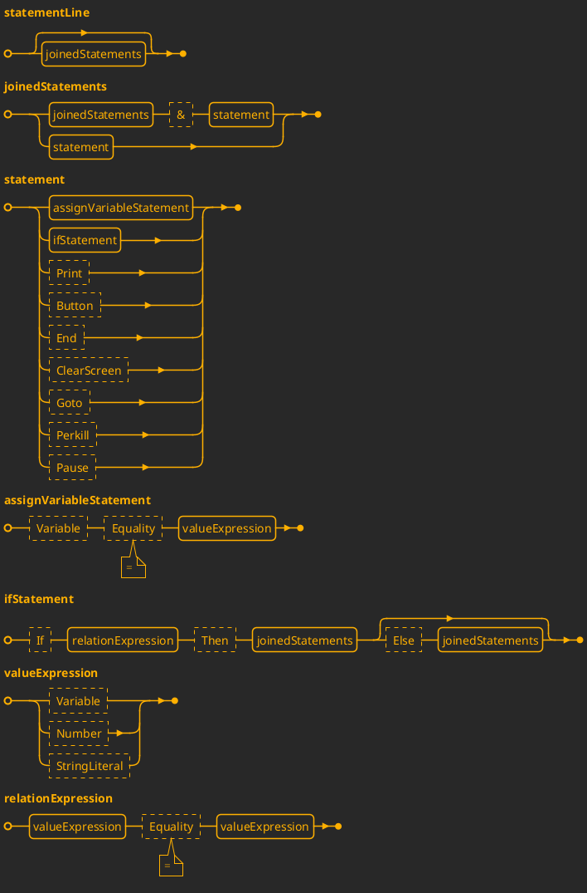
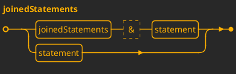
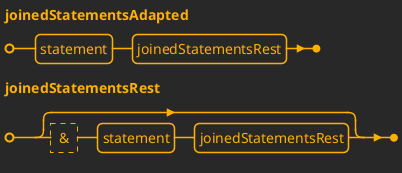

# Синтаксическая диаграмма

## Адаптация левых рекурсий
### Общая формула
$A \rightarrow A\alpha \mid A\beta \mid \gamma$
преобразуется в:
- $A \rightarrow \gamma R$
- $R \rightarrow \alpha R \mid \beta R \mid \epsilon$

### Адаптация `joinedStatements`
Исходный нетерминал:

Разбивка на элементы:
- $A = joinedStatements$
- $\alpha = `\&`, statement$
- $\gamma = statement$

Преобразование:
- $A \rightarrow statement, R$
- $R \rightarrow `\&`, statement, R \mid \epsilon$

