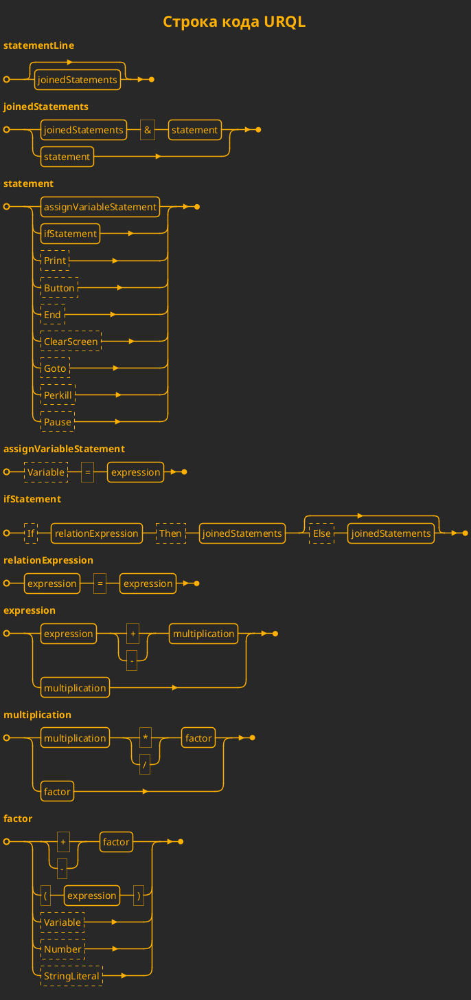
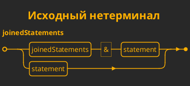
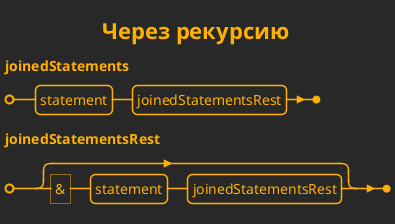
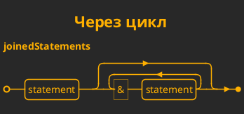
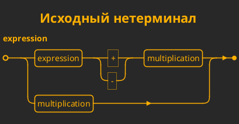
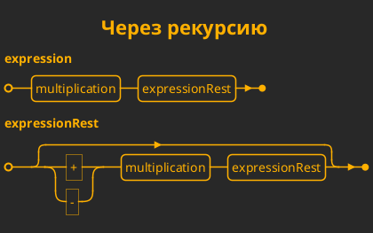
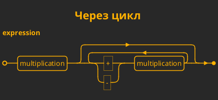
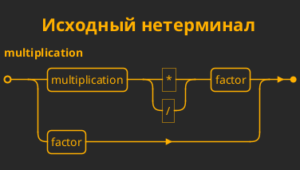
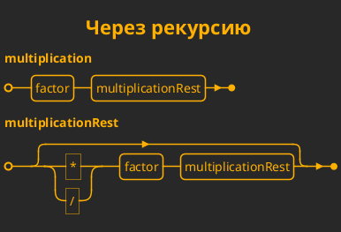
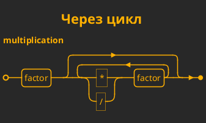

# Синтаксическая диаграмма

```plantuml
@startebnf URQL Line
!theme crt-amber
' skinparam monochrome reverse

title Строка кода URQL

statementLine = [ joinedStatements ];

joinedStatements = 
      joinedStatements, '&', statement
    | statement;

statement =
    assignVariableStatement
  | ifStatement
  | ?Print?
  | ?Button?
  | ?End?
  | ?ClearScreen?
  | ?Goto?
  | ?Perkill?
  | ?Pause?;

assignVariableStatement = ?Variable?,  '=', expression;

ifStatement = ?If?, relationExpression, ?Then?, joinedStatements, [ ?Else?, joinedStatements ];

relationExpression = expression, '=', expression;

expression =
    expression, ('+' | '-'), multiplication
  | multiplication;

multiplication =
    multiplication, ('*' | "/"), factor
  | factor;

factor =
    ('+' | '-'), factor
  | '(', expression, ')'
  | ?Variable?
  | ?Number?
  | ?StringLiteral?;
@endebnf
```

# Адаптация левых рекурсий
$$
A \rightarrow A\alpha \mid A\beta \mid \gamma
$$

преобразуется в:

$$
A \rightarrow \gamma R \newline
R \rightarrow \alpha R \mid \beta R \mid \epsilon
$$

## Адаптация `joinedStatements`

```plantuml
@startebnf Исходный joinedStatements
!theme crt-amber

title Исходный нетерминал

joinedStatements = 
      joinedStatements, '&', statement
    | statement;
@endebnf
```

### Разбивка на элементы
| Элемент | Значение  |
|:-------:| --------- |
| $A$ | $joinedStatements$  |
| $\alpha$  | ${'\&'}, statement$ | 
| $\gamma$  | $statement$ |

### Преобразование
| Формула | Результат |
| ------- | --------- |
| $A \rightarrow \gamma R$  | $joinedStatements \rightarrow statement, joinedStatementsRest$  |
| $R \rightarrow {\alpha R} \mid {\beta R} \mid \epsilon$ | $joinedStatementsRest \rightarrow {{'\&'}, statement, joinedStatementsRest} \mid \epsilon$  |

```plantuml
@startebnf Адаптация joinedStatements через рекурсию
!theme crt-amber

title Через рекурсию

joinedStatements = statement, joinedStatementsRest;
joinedStatementsRest = [ '&', statement, joinedStatementsRest ];
@endebnf
```

```plantuml
@startebnf Адаптация joinedStatements через цикл
!theme crt-amber

title Через цикл

joinedStatements = statement, { '&', statement };
@endebnf
```

## Адаптация `expression`

```plantuml
@startebnf Исходный expression
!theme crt-amber

title Исходный нетерминал

expression =
    expression, ('+' | '-'), multiplication
  | multiplication;
@endebnf
```

### Разбивка на элементы
| Элемент | Значение  |
|:-------:| --------- |
| $A$ | $expression$  |
| $\alpha$  | ${'+'}, multiplication$ |
| $\beta$ | ${'-'}, multiplication$ |
| $\gamma$  | $multiplication$ |

### Преобразование
| Формула | Результат |
| ------- | --------- |
| $A \rightarrow \gamma R$  | $expression \rightarrow multiplication, expressionRest$  |
| $R \rightarrow {\alpha R} \mid {\beta R} \mid \epsilon$ | $expressionRest \rightarrow {{'+'}, multiplication, expressionRest} \mid {{'-'}, multiplication, expressionRest} \mid \epsilon$  |

```plantuml
@startebnf Адаптация expression через рекурсию
!theme crt-amber

title Через рекурсию

expression = multiplication, expressionRest;
expressionRest = [ ('+' | '-'), multiplication, expressionRest] ;
@endebnf
```

```plantuml
@startebnf Адаптация expression через цикл
!theme crt-amber

title Через цикл

expression = multiplication, { ('+' | '-'), multiplication };
@endebnf
```

## Адаптация `multiplication`

```plantuml
@startebnf Исходный multiplication
!theme crt-amber

title Исходный нетерминал

multiplication =
    multiplication, ('*' | "/"), factor
  | factor;
@endebnf
```

### Разбивка на элементы
| Элемент | Значение  |
|:-------:| --------- |
| $A$ | $multiplication$  |
| $\alpha$  | ${'*'}, factor$ |
| $\beta$ | ${'*'}, factor$ |
| $\gamma$  | $factor$ |

### Преобразование
| Формула | Результат |
| ------- | --------- |
| $A \rightarrow \gamma R$  | $multiplication \rightarrow factor, multiplicationRest$  |
| $R \rightarrow {\alpha R} \mid {\beta R} \mid \epsilon$ | $multiplicationRest \rightarrow {{'*'}, factor, multiplicationRest} \mid {{'/'}, factor, multiplicationRest} \mid \epsilon$  |

```plantuml
@startebnf Адаптация multiplication через рекурсию
!theme crt-amber

title Через рекурсию

multiplication = factor, multiplicationRest;
multiplicationRest = [('*' | '/'), factor, multiplicationRest];
@endebnf
```

```plantuml
@startebnf Адаптация multiplication через цикл
!theme crt-amber

title Через цикл

multiplication = factor, {('*' | '/'), factor};
@endebnf
```