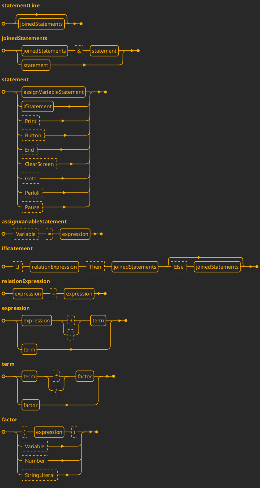
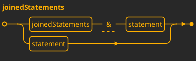
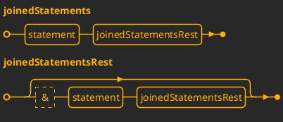
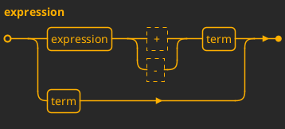
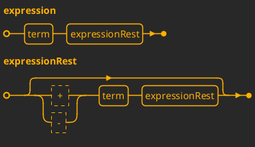
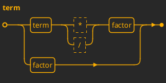
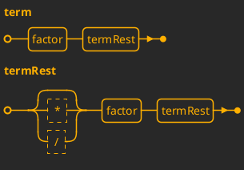

# Синтаксическая диаграмма

```plantuml
@startebnf URQL Line
!theme crt-amber
' skinparam monochrome reverse

statementLine = [ joinedStatements ];

joinedStatements = 
      joinedStatements, ?&?, statement
    | statement;

statement =
    assignVariableStatement
  | ifStatement
  | ? Print ?
  | ? Button ?
  | ? End ?
  | ? ClearScreen ?
  | ? Goto ?
  | ? Perkill ?
  | ? Pause ?;

assignVariableStatement = ? Variable ?,  ?=?, expression;

ifStatement = ? If ?, relationExpression, ? Then ?, joinedStatements, [ ? Else ?, joinedStatements ];

relationExpression = expression, ?=?, expression;

expression =
    expression, (?+? | ?-?), term
  | term;

term =
    term, (?*? | ?/?), factor
  | factor;

factor =
    ?(?, expression, ?)?
  | ? Variable ?
  | ? Number ?
  | ? StringLiteral ?;
@endebnf
```

# Адаптация левых рекурсий
$$
A \rightarrow A\alpha \mid A\beta \mid \gamma
$$
преобразуется в:
$$
A \rightarrow \gamma R \newline
R \rightarrow \alpha R \mid \beta R \mid \epsilon
$$

## Адаптация `joinedStatements`
### Исходный нетерминал

```plantuml
@startebnf joinedStatements
!theme crt-amber

joinedStatements = 
      joinedStatements, ? & ?, statement
    | statement;
@endebnf
```

### Разбивка на элементы
| Элемент | Значение  |
|:-------:| --------- |
| $A$ | $joinedStatements$  |
| $\alpha$  | ${"\&"}, statement$ | 
| $\gamma$  | $statement$ |

### Преобразование
| Формула | Результат |
| ------- | --------- |
| $A \rightarrow \gamma R$  | $joinedStatements \rightarrow statement, joinedStatementsRest$  |
| $R \rightarrow {\alpha R} \mid {\beta R} \mid \epsilon$ | $joinedStatementsRest \rightarrow {{"\&"}, statement, joinedStatementsRest} \mid \epsilon$  |

```plantuml
@startebnf Адаптация joinedStatements
!theme crt-amber

joinedStatements = statement, joinedStatementsRest;
joinedStatementsRest = [? & ?, statement, joinedStatementsRest];
@endebnf
```

## Адаптация `expression`
### Исходный нетерминал

```plantuml
@startebnf joinedStatements
!theme crt-amber

expression =
    expression, (? + ? | ? - ?), term
  | term;
@endebnf
```

### Разбивка на элементы
| Элемент | Значение  |
|:-------:| --------- |
| $A$ | $expression$  |
| $\alpha$  | ${"+"}, term$ |
| $\beta$ | ${"-"}, term$ |
| $\gamma$  | $term$ |

### Преобразование
| Формула | Результат |
| ------- | --------- |
| $A \rightarrow \gamma R$  | $expression \rightarrow term, expressionRest$  |
| $R \rightarrow {\alpha R} \mid {\beta R} \mid \epsilon$ | $expressionRest \rightarrow {{"+"}, term, expressionRest} \mid {{"-"}, term, expressionRest} \mid \epsilon$  |

```plantuml
@startebnf joinedStatements
!theme crt-amber
expression = term, expressionRest;
expressionRest = [ (? + ? | ? - ?), term, expressionRest] ;
@endebnf
```

## Адаптация `term`
### Исходный нетерминал

```plantuml
@startebnf joinedStatements
!theme crt-amber

term =
    term, (? * ? | ? / ?), factor
  | factor;
@endebnf
```

### Разбивка на элементы
| Элемент | Значение  |
|:-------:| --------- |
| $A$ | $term$  |
| $\alpha$  | ${"*"}, factor$ |
| $\beta$ | ${"*"}, factor$ |
| $\gamma$  | $factor$ |

### Преобразование
| Формула | Результат |
| ------- | --------- |
| $A \rightarrow \gamma R$  | $term \rightarrow factor, termRest$  |
| $R \rightarrow {\alpha R} \mid {\beta R} \mid \epsilon$ | $termRest \rightarrow {{"*"}, factor, termRest} \mid {{"/"}, factor, termRest} \mid \epsilon$  |

```plantuml
@startebnf joinedStatements
!theme crt-amber
term = factor, termRest;
termRest = [ (? * ? | ? / ?) ], factor, termRest;
@endebnf
```