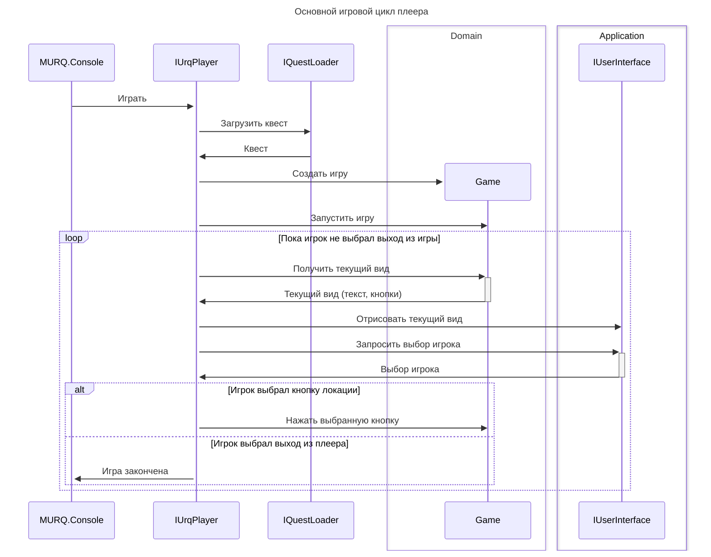

Архитектура MURQ.Console.

# Диаграмма вызовов
```plantuml
title Основной игровой цикл плеера

[-> IUrqPlayer ++ : Играть
IUrqPlayer -> IQuestLoader ++: Загрузить квест
return Квест

IUrqPlayer -> Game **: Создать игру
IUrqPlayer -> Game: Запустить игру

loop Пока игрок не выбрал выход из игры
    IUrqPlayer -> Game ++ : Получить текущий вид
    return Текущий вид (текст, кнопки)

    IUrqPlayer -> IUserInterface: Отрисовать текущий вид
    IUrqPlayer -> IUserInterface ++: Запросить выбор игрока
    return Выбор игрока

    alt Игрок выбрал кнопку локации
        IUrqPlayer -> Game: Нажать выбранную кнопку
    else Игрок выбрал выход из плеера
        IUrqPlayer ->x[: Игра закончена
    end
end

box Application
    participant IUrqPlayer
    participant IQuestLoader
    participant IUserInterface
end box
box Domain
    participant Game
end box
```


